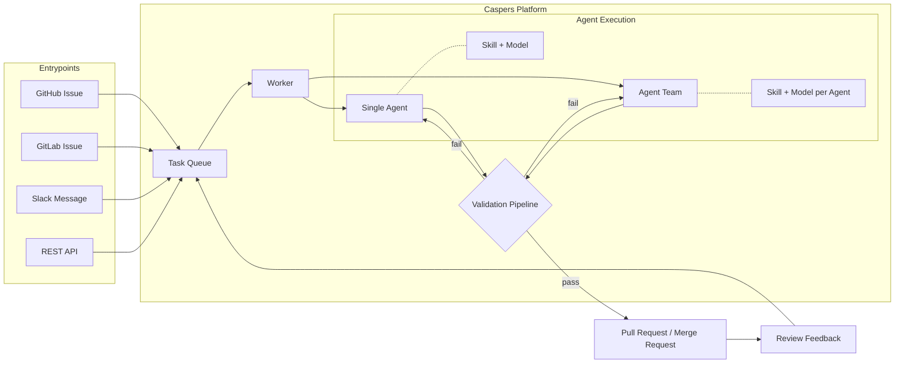

# 👻 Caspers

> 🚧 **Currently in development**  
> Caspers is actively being built and will be released soon.  
> If you're interested, ⭐ follow/watch this repository for updates and early releases.

**Agentic coding system** - receive tasks from Slack, GitHub, GitLab or a REST API, dispatch them to an LLM agent running inside an isolated environment, validate changes through a multi-step pipeline, open pull requests, and iterate on review feedback.

---

## Overview

Caspers bridges the gap between developer intent and working code. You describe what you want in a GitHub issue, a Slack message or a REST call and Caspers agentically implements it, validates it, opens a pull request, and refines it based on your review.

Behind the scenes, Caspers acts like your own team of **AI ghost producers** — quietly turning tasks and ideas into working code while you stay focused on the bigger picture.

No context switching. No boilerplate. Just working code.

---

## Key Features

**Work from anywhere.** Create and refine tasks from your phone, laptop, or anywhere in the world. Describe work in natural language and receive previews or artifacts without needing a local development environment.

**Works where you already work.** Submit tasks from GitHub Issues, GitLab Issues, Slack, or directly via the REST API. Caspers normalizes all inputs into the same pipeline -- no special setup per channel.

**Your LLM, your terms.** Use Claude, GPT-4o, Gemini, or any OpenAI-compatible endpoint (Ollama, vLLM, LM Studio) with an API key. Or skip the API entirely and use your existing Claude or Gemini subscription via the CLI tools -- zero additional cost.

**Validation before you ever see the PR.** Every change runs through a configurable pipeline: formatter, linter, typechecker, tests, integration tests, build. The agent auto-repairs failures and retries before surfacing the PR.

**Distributed execution.** Agents run inside ephemeral Docker containers with isolation by default. Workers scale horizontally — spin up additional worker instances and they automatically register with the API and begin accepting jobs.

**Preview environments and artifacts.** Optionally spin up Docker Compose previews per branch (identified by `casper/<task-uuid>`) via `.caspers/preview.yml`. Routing is label-driven through your server-side proxy (Caddy/Traefik/Nginx).  
Preview jobs can also generate **build artifacts** such as APK files, compiled binaries, static builds, or other downloadable outputs so you can test results immediately without merging the code.

**Review-driven iteration.** Post a GitHub review, GitLab comment, or Slack thread reply and Caspers re-runs the agent with your feedback, force-pushes the branch, and waits for another review -- up to 10 iterations.

**Single agents or agent teams.** Run a single agent on a focused task, or assemble a team of agents that collaborate on a larger objective. Team members communicate with each other, decompose work, execute in parallel where possible, and merge the results — all within one task lifecycle.

**Skill-based agents.** Each agent has a defined skill — documentation, testing, refactoring, architecture, frontend, etc. Skills shape the agent's system prompt, tool access, and conventions so it stays focused on what it does best.

**Right model for the job.** Assign different LLM models per agent based on task complexity. A documentation agent can use a fast, inexpensive model while an architecture agent uses an advanced reasoning model — optimising cost without sacrificing quality where it matters.

**Cost-controlled.** Per-task token budgets enforce spend limits. Subscription-based providers report zero cost. Costs are tracked and persisted per agent run.

**Open source and feature-complete.** The Community Edition is fully open source under the MIT license and ships with every core capability — no artificial limits, no feature gates. Self-host it on your own infrastructure and own your entire pipeline.

**Managed SaaS available.** Prefer not to self-host? Caspers Cloud is a hosted, closed-source edition with additional features and zero operational overhead — we handle infrastructure, updates, and scaling for you.

---

## How It Works

---

## License

MIT
